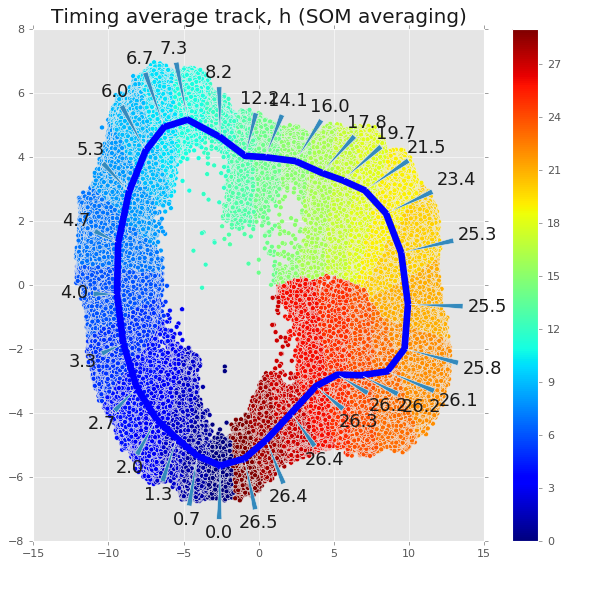

# DeepCycle

This README outlines steps required to reproduce approach from *DeepCycle* manuscript.

#### Requirements
[keras](https://keras.io), [UMAP](https://github.com/lmcinnes/umap), [cv2](https://pypi.org/project/opencv-python/), [albumentations](https://github.com/albumentations-team/albumentations), [classification_models](https://github.com/qubvel/classification_models)  
Install customized version of [SOMPY](https://github.com/alexander-rakhlin/SOMPY)

#### How ro run
1. Download data

2. Unzip to `data/Timelapse_2019` folder preserving directory structure. You will have: 
    ```
    root|
        |-data|
        |     |-Timelapse_2019|
        |                     |-BF/
        |                     |-Cy3/
        |                     |-DAPI/
        |                     |-GFP/
        |                     |-curated_tracks.csv
        |                     |- ...
        |-src/
        |...
    ```

3. `cd src`
4. Prepare the data:  
`python data_prepare.py`
    - Cleans and removes unnecessary columns. Stores as `statistics_clean.csv` in `data/Timelapse_2019` dir
    - Aligns ~1000 curated tracks based on division events, calculates mean intensities track/frame wise. Stores as `intensities.csv`  
    - Calculates intensity statistics and adds virtual class `1-4` to each tracked cell. Resulting data to be stored in `statistics_mean_std.csv`
5. Tran the model:  
`python model_train.py`  
Trains the model  on curated tracks (less double division tracks) using double division tracks as validation set. Saves best models in `checkpoints` dir
6. Generate cell descriptors with `checkpoint.r34.sz48.03-0.73.hdf5` as default model:
    - from validation set (double division tracks) only:  
    `python encode.py --mode encode_val`  
    - from all available tracks:  
    `python encode.py --mode encode_all`  
Descriptors are saved in `descriptors.r34.sz48.pkl` and `descriptors_all.r34.sz48.pkl` in `data/Timelapse_2019` dir.    
7. Generate embeddings for all dataset. Compute intense, consider using supplied `embeddings_preds_all_batch<i>.npz` instead:  
`python all_cells_prediction.py`
8. `cd ..`   
9. start `jupyter notebook` and open `timelapse_projection2019.ipynb`  


  
 